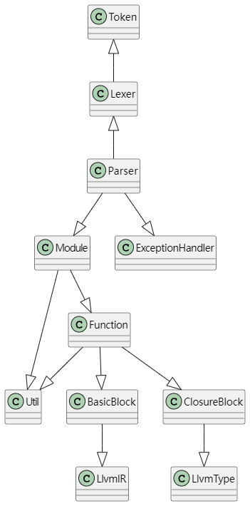
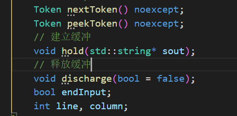
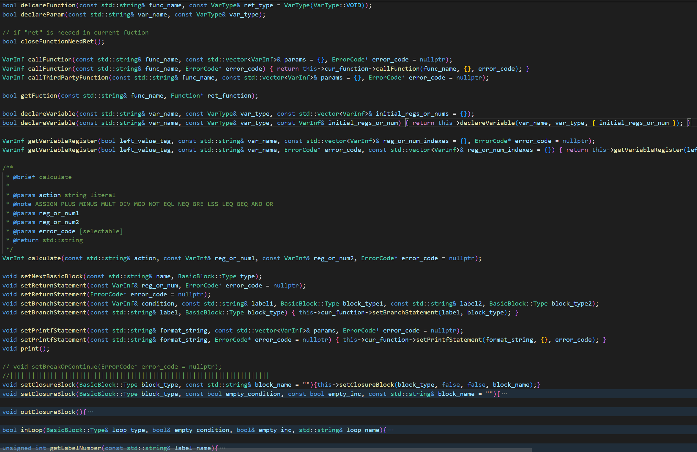
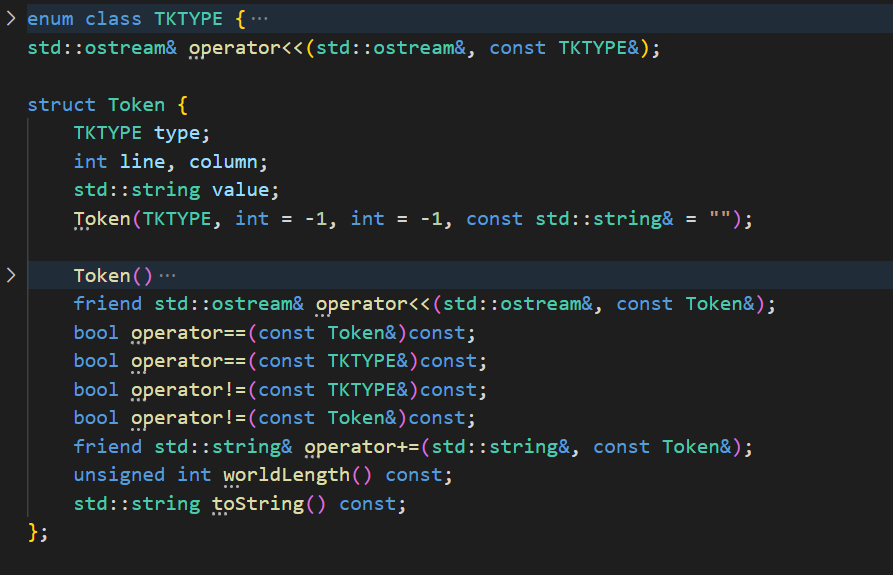
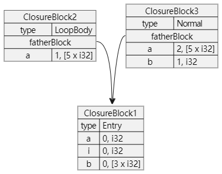
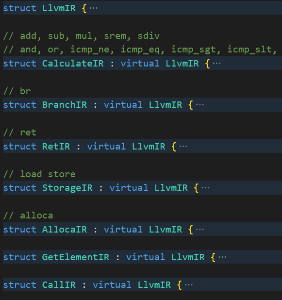
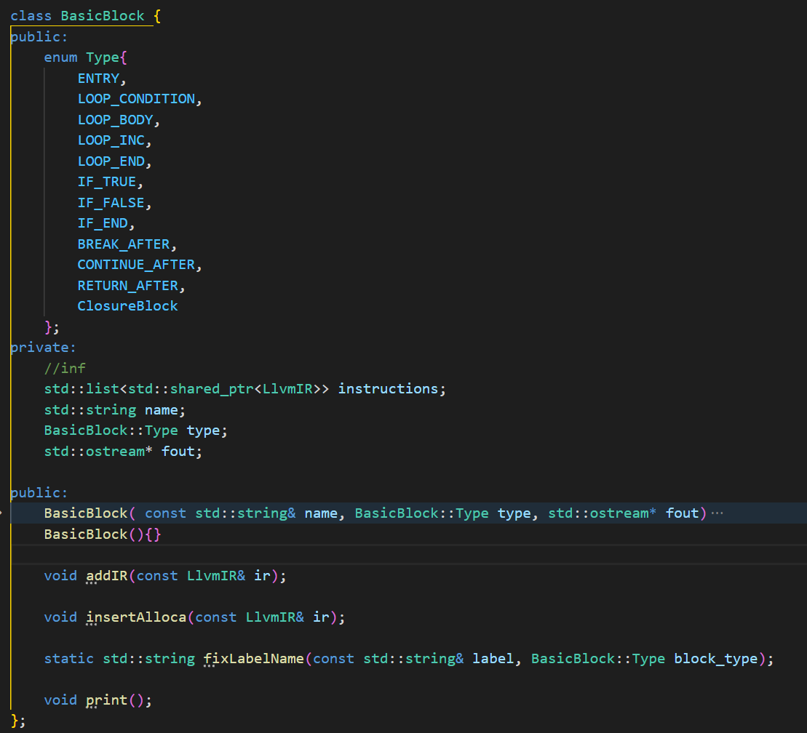

# 2023编译实验

## what is this

这是编译实验的一个小小的、C++11编写的sysy到llvm的编译器
输入是`testfile.txt`，输出是`output.txt`、`llvm_ir.txt`、`error.txt`
输入要求的sysy语法限制，见`2023编译实验文法说明.pdf`

## 参考

编译理论教材

llvm官方指令文档

## 总体结构

包含 词法分析器，语法分析器，符号表，错误处理程序，IR生成 等模块，整体关系如下



### 接口设计

- Lexer 通过 Token 向 Parser 单向传递信息



    流式读入，通过缓冲 hold 设置恢复点，在 discharge 时选择是否回到恢复点

- Parser 通过 CompilerException 向 ExceptionHandler 传递错误控制错误打印

  
- Parser 与 Module 通过 VarInf 进行交互

  

  接口包括 函数定义、参数定义、变量定义、获取当前函数、获取变量寄存器、计算语句、设置基本快、设置变量命名域、设置返回、跳转、打印、判断是否在循环内、获取label的下一个编号

### 文件组织

```cmd
include
  │  lexer.h
  │  parser.h
  │  token.h
  │
  ├─exception
  │    exception.h
  │
  ├─ir_gen
  │    basic_block.h
  │    closure_block.h
  │    function.h
  │    instruction.h
  │    llvm_type.h
  │    module.h
  │
  └─util
       util.h

src
  │  lexer.cpp
  │  parser.cpp
  │  token.cpp
  │
  ├─exception
  │    exception.cpp
  │
  ├─ir_gen
  │    basic_block.cpp
  │    closure_block.cpp
  │    function.cpp
  │    instruction.cpp
  │    llvm_type.cpp
  │    module.cpp
  │
  └─util
        util.cpp

test.cpp

```

## 词法分析

### Token



Token 包含当前Token的类型、行列位置、原本字符串值(value)，用于Lexer 向 Parser 传递信息

### Lexer

#### Token结构体

包含类型，原串内容，所在行列

#### peek实现

通过Lexer::peek标志判定是否有预读，Lexer::peekToken 在无标记时读取下一个到Lexer::curToken并添加标记，Lexer::nextToken 在有该标记时直接返回Lexer::curToken并清除标记。

#### 还原点 (语法分析时拓展部分)

通过Lexer::hold 设置Lexer::save标记，该标记存在时会在 Lexer::nextToken 返回Token值时拷贝一份到Lexer::tokenBuffer缓冲区中

通过Lexer::discharge 设置 Lexer::load 标记, 该标记会在 Lexer::peekToken 和 Lexer::nextToken 读取下一个Token时直接读取Lexer::tokenBuffer中的Token

#### 输入流读取下一个Token

通过 Lexer::curChar 选择 Token 解析函数

```cpp
// 读取数字Token
Token digitHeader(char) noexcept;
// 读取保留字和变量名
Token alphaHeader(char) noexcept;
// 读取符号关键字和常字符串
Token signHeader(char) noexcept;
```

读取完成后内部调用 Lexer::nextChar 过滤空格和换行 读取下一个Token首字符

## 错误处理

### CompilerException

包含错误类型和所在行列

### ExceptionHandler（代码生成时修改）

#### 原设计: 直接在Parser中 fout 输出到 error.txt

#### ExceptionHandler::handle

只进行了输出，出于扩展考虑而形成单独的处理函数

## 符号表管理

### VarType

包含 常数标志、内类型、内类型指针深度、数组维度、数组指针深度，抽象llvm的变量类型如下

```cpp
[<array_degrees[0]>...[<array_degrees[i]> x <type>*——*]...]*——*
```

### ClosureBlock

#### 表项

| 变量名 | 序号 | 变量类型(VarType) |
| ------ | ---- | ----------------- |

#### 区分命名空间

采用树状结构连接，每个块记录其父节点，父节点为外层命名空间，e.g.

```cpp
int test(){
 // entry
 int i, a;
 int b[3];
 for(i = 0; i < 10; i = i + 1) {
  int a;
 }
 {
  int a[5], b;
 }
}
```



查找时自己没有的变量不断地向下的祖先块查找直到顶层的全局块，找到之后返回 "<变量名>.<序号>"字符串 和 变量类型

#### 块环境判断/循环中判断

给每个块加上一个 type 标记当前空间类型，用于判定是否在循环 (type 为 LoopBody) 中，查找时和查找变量过程相似

#### 全局表

```cpp
std::map<std::string, GlobalVarInf> global_var_infs;


struct GlobalVarInf {
    VarType type;
    std::vector<VarInf> initial_values;
    GlobalVarInf(VarType type, const std::vector<VarInf>& initial_values = {}): type(type), initial_values(initial_values){}
    VarType getVisit(const std::vector<unsigned int>& indexes, std::string* value, ErrorCode* error_code) const;
};
```

编码后添加全局表getVisit函数，用于静态取常值和检查超界。

## 代码生成

### VarInf

```cpp
struct VarInf {
    VarType type;
    std::string name;
};
```

#### 变量命名规范

编码前计划在局部栈开空间存常量，较为麻烦，改成常量提升全局

为每个sysy中的变量开辟一些空间，然后用其变量名为基础修正后为这个地址命名，具体规范如下

- IR局部地址变量统一用 %`<varnNme>.<labelNumber>` 命名
- IR寄存器变量统一用 %reg `<regNumber>` 命名
- 全局变量（本来就是）统一用 @`<varName>.<labelNumber>` 命名
- 提升到全局的常量 统一中 @`<functionName>.<varName>.<labelNumber>`命名

由于语法规定命名中不能存在 '.' 这样不会造成获取变量时的二义性

### LlvmIR



包括 接口、计算指令、分支指令、返回指令、内存操作指令、内存分配指令、地址计算指令、函数调用，用于抽象表示llvm ir

编码前没有将StorageIR和AllocaIR分开，编码过程中发现容易混淆于是将其分开

### BasicBlock



包括基本块类型、基本块label，操作函数包括 按顺序插入一条IR 和 在最后一条 br 或者 ret 前插入一条内存声明语句

#### 规范出口

Parser 保证在每条 br 语句之后紧跟着会新建一个基本块以此保证每个基本块只有只有一条 br 指令

#### 命名规范

基本块名除了 Entry 和 ClosureBlock(给命名空间提供的) 类型外，由 类型 和 label Number 两部分组成

```cpp
switch (block_type) {
    case BasicBlock::ENTRY:
        fix_label = "entry";
        break;
    case BasicBlock::IF_TRUE:
        fix_label = "if." + label + '.' + "true";
        break;
    case BasicBlock::IF_FALSE:
        fix_label = "if." + label + '.' + "false";
        break;
    case BasicBlock::IF_END:
        fix_label = "if." + label + '.' + "end";
        break;
    case BasicBlock::LOOP_BODY:
        fix_label = "loop." + label + '.' + "body";
        break;
    case BasicBlock::LOOP_CONDITION:
        fix_label = "loop." + label + '.' + "condition";
        break;
    case BasicBlock::LOOP_INC:
        fix_label = "loop." + label + '.' + "inc";
        break;
    case BasicBlock::LOOP_END:
        fix_label = "loop." + label + '.' + "end";
        break;
    case BasicBlock::BREAK_AFTER:
        fix_label = "break." + label + ".after";
        break;
    case BasicBlock::CONTINUE_AFTER:
        fix_label = "continue." + label + ".after";
        break;
    case BasicBlock::RETURN_AFTER:
        fix_label = "return." + label + ".after";
        break;
    }
```

### Function

数据：

- 函数类型

```cpp
struct FunctionType {
    VarType retType;
    std::vector<VarType> paramsType;
};
```

- 函数名
- 全局环境

```cpp
std::map<std::string, GlobalVarInf>& global_var_map;
std::map<std::string, Function>& function_map;
```

- 命名空间

```cpp
// 命名空间管理
ClosureManager var_closure_block_manager;
// 函数内虚拟寄存器管理
std::map<std::string, VarType> reg_map;

// ClosureManager定义如下
class ClosureManager {
private:
    std::map<std::string, unsigned int> var_numbers;
        std::list<ClosureBlock> closure_blocks;
    ClosureBlock* cur_block;

public:
    ClosureManager()
    {
        this->closure_blocks.push_back(ClosureBlock());
        this->cur_block = &this->closure_blocks.back();
    }
    void setNextBlock(const BasicBlock::Type block_type, const std::string& loop_name = ""){this->setNextBlock(block_type, false, false, loop_name);};
    void setNextBlock(const BasicBlock::Type block_type, const bool empty_condition, const bool empty_inc, const std::string& block_name = "");
    // check if have 'Return' statement in curTable Block
    void setUpperBlock();

    bool insertVariable(const VarType& var_type, const std::string& var_name, std::string& ret_var_name);

    ClosureBlock* getCurBlock() { return cur_block; }
}；

```

- 基本块

`std::map<std::string, BasicBlock> basicBlocks;`

#### 变量声明

不管什么类型的量都会在当前命名空间插入一条记录，然后分类型处理

- 常数，加上函数标记后提升成全局变量，无初始值的0初始化
- 非常数，无初始值，直接生成一条alloca指令
- 非常数，有初始值，除了alloca之外还生成 getelementptr 和 save 指令对其初始化

#### 参数声明

- 首先在函数类型中插入一个参数类型
- 分配一个临时寄存器作为该参数变量的初始值然后调用变量声明

#### 获取sysy变量值 或 值的地址寄存器

这里需要考虑左右值

左值:

- 常数，常量修改错误
- 变量或变量数组无偏移，直接返回命名空间查到的地址寄存器
- 变量数组并且有偏移，取到命名空间查到的地址寄存器后
  - 如果数组指针深度大于1 (说明该寄存器是地址值的地址) ，需要先 load 加载地址值
  - getelementptr计算偏移

右值:

首先判断最外层指针是否是深度大于1，若是，则需要先load到维度为1

- 常数，添加函数标记后到全局环境查找值 直接返回值字符串
- 常数数组，取得寄存器计算偏移后如果是一个常数指针类型 (i32*)，则如同常数一样返回，否则生成getelementptr并返回一个地址寄存器
- 变量，load后返回
- 变量数组，生成 getelementptr 获取偏移地址寄存器，取得的偏移地址寄存器如果是一个变量指针类型 (i32*)，则 load 后返回，否则直接返回偏移地址寄存器

#### 计算语句

检查并生成 `ASSIGN PLUS MINUS MULT DIV MOD NOT EQL NEQ GRE LSS LEQ GEQ AND OR` 语句对应的IR

检查包括类型检查，ASSIGN 还要检查 常量赋值

#### 函数调用检查

通过Module的函数环境获取目标函数，并检查参数数目和类型，通过后生成CALL指令

#### 三方库函数检查

getint putint putchar 和 putstr 的检查和调用生成

#### 分支语句和返回语句

分支语句可直接设置，其正确性由命名逻辑保证

返回语句需要检查当前函数的返回类型，通过后生成IR

#### 打印函数翻译

检查字符串的合法性，%d的个数与参数个数是否对应

将其拆分为数条call putint和call putchar指令

#### 结束时返回语句缺失检查

返回void的函数缺失的情况下自动补全 `ret void`，其它情况缺失返回语句应该报错

### Module

记录全局变量和函数列表并保持当前函数

```cpp
std::map<std::string, GlobalVarInf> global_var_infs;
std::map<std::string, Function> functions;
Function* cur_function = nullptr;
```

#### 全局变量声明

当持有的当前函数指针为空时说明在全局环境，直接在 `global_var_infs`插入相关信息

#### 全局变量获取

当持有的当前函数指针为空时说明在全局环境，需要检查数组类型的偏移数组是否都是常数，最终返回常数

#### 计算语句

当持有的当前函数指针为空时说明在全局环境，需要操作数是否都是常数以及类型是否正确，最终返回计算结果

## 语法分析

参考编译理论书递归下降语法分析设计，给（几乎）每个非终结符写一个解析函数然后互相调用，一边读取一边检查一边生成IR

迭代历程

- 语法分析时检查token的顺序是否正确
- 错误处理时加入了错误信息打印
- 代码生成时废弃了原来的错误处理，将之内置到Module中

### 各函数使用的IR生成接口

| parser function | 接口                                                                                                                                                                                                                                                                                                   |
| --------------- | ------------------------------------------------------------------------------------------------------------------------------------------------------------------------------------------------------------------------------------------------------------------------------------------------------ |
| CompUnit        |                                                                                                                                                                                                                                                                                                        |
| ConstDecl       | Module::declareVariable                                                                                                                                                                                                                                                                                |
| VarDecl         | Module::declareVariable                                                                                                                                                                                                                                                                                |
| InitVal         |                                                                                                                                                                                                                                                                                                        |
| ConstExp        |                                                                                                                                                                                                                                                                                                        |
| Exp             |                                                                                                                                                                                                                                                                                                        |
| AddExp          | Module::calculate                                                                                                                                                                                                                                                                                      |
| MulExp          | Module::calculate                                                                                                                                                                                                                                                                                      |
| UnaryExp        | Module::calculate<br />Module::getFuction<br />Modele::callFunction                                                                                                                                                                                                                                    |
| PrimaryExp      |                                                                                                                                                                                                                                                                                                        |
| FuncRParams     |                                                                                                                                                                                                                                                                                                        |
| FuncDef         | Module::delcareFunction<br />Module::declareParam<br />Module::closeFunctionNeedRet                                                                                                                                                                                                                    |
| Block           |                                                                                                                                                                                                                                                                                                        |
| Stmt            | Module::getLabelNumber<br />Module::setBranchStatement<br />Module::setNextBasicBlock<br />Module::getLabelNumber<br />Module::calculate<br />Module::setPrintfStatement<br />Module::callThirdPartyFunction<br />Module::setClosureBlock<br />Module::outClosureBlock<br />Module::setReturnStatement |
| LVal            | Module::getVariableRegister                                                                                                                                                                                                                                                                            |
| RelExp          | Module::calculate                                                                                                                                                                                                                                                                                      |
| EqExp           | Module::calculate                                                                                                                                                                                                                                                                                      |
| LAndExp         | Module::setBranchStatement<br />Module::setNextBasicBlock                                                                                                                                                                                                                                              |
| LOrExp          | Module::setBranchStatement<br />Module::setNextBasicBlock                                                                                                                                                                                                                                              |

### 声明

VarDecl 和 ConstDecl 调用 ConstExp 获取声明的数组的维度，调用 InitVal 获取初始值（数组）。将信息收集完后调用 Module::declareVariable 记录变量

FuncDef 先调用 Module::delcareFunction 新建一个函数空间，解析参数时同时调用 Module::declareParam 声明参数，然后调用Block解析函数体，最后在递归返回时 Module::closeFunctionNeedRet 关闭函数并检查 ret 缺失

### 取值

LVal是获取变量的最终函数，接收 左值标签，获取偏移地址后 调用 Module::getVariableRegister 获取经过偏移计算后的临时寄存器 或者 原地址寄存器 或者 常数

UnaryExp调用 Modele::callFunction 获得一个返回值寄存器（返回值可能为Void）

### 计算语句

通过 Module::calculate 计算返回结果寄存器并检查计算类型是否匹配

### for循环

`'for''(' [ForStmt] ';' [Cond] ';' [ForStmt] ')'Stmt`

首先获取 for 的 labelNumber

将for循环拆分为 loop_condition、loop_body、loop_inc 三个部分，对应三个基本块，出口为loop_end，对应循环后的基本块(，初始化在上一个basic block中)，解析 第一个 `ForStmt` 后

检查是否存在 `Cond` ，存在则 `br loop.<labelNumber>.condition` 并设置下一个基本块为 `loop.<labelNumber>.condition` 并进行调用 LorExp 进行条件解析并将 条件为假时的跳转 label 设置为 `loop.<labelNumber>.end`，不存在则记下一个 `Cond` 缺失标记

检查第二个  `ForStmt` 是否存在，若存在，则进行循环后操作并 在无 `Cond` 缺失时设置  `br loop.<labelNumber>.condition`，有该标记时设置 `br loop.<labelNumber>.body`，不存在则记下一个 `inc`缺失标记

设置 `loop.<labelNumber>.body`基本块调用 Stmt 解析循环体，递归返回时，无 `inc` 缺失，设置  `br loop.<labelNumber>.inc`，`inc`缺失但是无 `cond` 缺失，设置 `br loop.<labelNumber>.condition`，都缺失直接设置 `br loop.<labelNumber>.body`，并设置下一个基本块为 `loop.<labelNumber>.end`

### if语句

`'if''('Cond')'Stmt [ 'else'Stmt ]`

首先获取 if 的 labelNumber

将 if 拆分为 if_true, if_false, if_end(如果else存在)，调用 LorExp 解析 Cond， 设置 `br i1 <cond> if.<labelNumber>.true, if.<labelNumber>.false` 后设置下一个基本块为 `if.<labelNumber>.true`，调用Stmt返回后，没有 else 则设置 `br if.<labelNumber>.false`退出 if，设置下一个基本块为 `if.<labelNumber>.false`

否则设置 `br if.<labelNumber>.end`退出if_true块，并设置下一个块为 `if.<labelNumber>.false`，调用Stmt返回后，设置 `br if.<labelNumber>.end`退出 if，设置下一个基本块为 `if.<labelNumber>.end`

### return语句

直接调用 Module::setReturnStatement 设置返回语句并检查返回值类型，并设置下一个基本块为 `return.<labelNumber>.after`

### printf语句

调用 Module::setPrintfStatement 进行字符串合法检查，参数个数检查并拆分为多个输出函数

### gitInt

调用 Module::callThirdPartyFunction('getint') 获得一个返回值寄存器

### Block创建

在调用Lexer::Block前后紧接 `Module::setClosureBlock` 和 `Module::outClosureBlock`保证命名空间结构正确

### 短路求值

`LOrExp→LAndExp|LOrExp'||'LAndExp`

`LAndExp→EqExp|LAndExp'&&'EqExp`

LOrExp和LAndExp会返回最后一个表达式，用来和调用者需要一个条件值寄存器来跳转的需求做兼容，而 || 和 && 前的表达式直接生成跳转

LAndExp 会在每个 EqExp 返回 `%reg<x>`时设置 `br i1 %reg<x> label <originLabel>.land<i>.true, <originLabel>.false` 并设置下一个基本块为 `<originLabel>.land<i>.true`

LOrExp 会在每个 LAndExp 返回 `%reg<x>`时设置 `br i1 %reg<x> label <originLabel>.true, <originLabel>.lor<i>.false` 并设置下一个基本块为 `<originLabel>.lor<i>.false`
